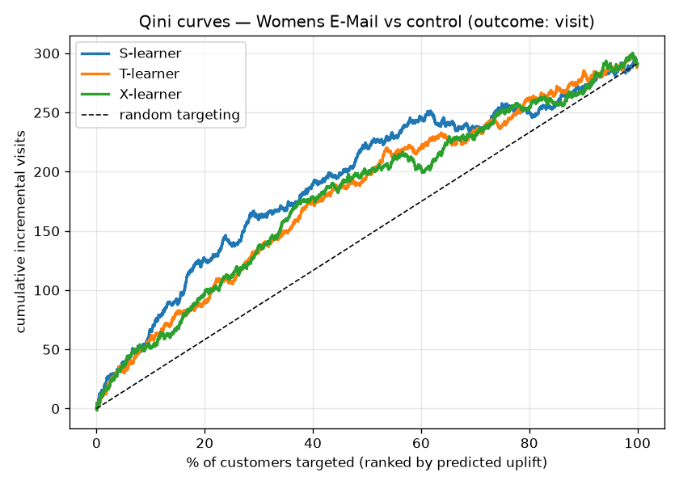

# Experimentation & Uplift — A/B Analysis, CUPED, and Who-to-Target on a Randomized Trial

An honest end-to-end analysis of a **randomized** e-mail marketing experiment:
estimate the treatment effect properly, try to make it more precise, and then use
it to decide *whom* to treat next — with every claim checked against held-out data
or a synthetic ground truth.

## Summary

This project works through the three questions a commercial data scientist asks of
an experiment, in order:

1. **Did it work, and how sure are we?** Average treatment effects by difference
   in means, with unpooled CIs, a minimum-detectable-effect calculation, and
   multiplicity control across the arm × outcome grid.
2. **Can we measure it more cheaply?** CUPED and regression adjustment for
   variance reduction — and an honest accounting of when they *don't* help.
3. **Whom should we target?** Uplift (heterogeneous-treatment-effect) models —
   S-/T-/X-learners — evaluated with Qini curves on a held-out split and turned
   into a concrete targeting policy.

The data is Kevin Hillstrom's classic MineThatData e-mail trial: 64,000 customers
randomly assigned to a men's e-mail, a women's e-mail, or no e-mail, with visit /
conversion / spend measured over the next two weeks. It ships in this repository
(3.96 MB): clone and run, no accounts, no API keys, no downloads.

### The honest headline

**The men's e-mail has the larger average effect, but the women's e-mail is the
one worth *targeting*** — and the variance-reduction step, done honestly, barely
moves on this data because the pre-period covariates scarcely predict a two-week
response. Sophistication is deployed where it pays (finding whom to target) and
declined where it doesn't (CUPED on uncorrelated covariates). That discipline is
the point of the project.

**Average treatment effects (difference in means; 21.3k per arm; Holm-adjusted across 6 tests):**

| Arm | Outcome | Control | Treated | Effect | Lift | 95% CI | Holm p |
|---|---|---|---|---|---|---|---|
| Mens | visit | 10.62% | 18.28% | **+7.66pp** | +72% | [+7.00, +8.32]pp | <1e-16 |
| Womens | visit | 10.62% | 15.14% | **+4.52pp** | +43% | [+3.89, +5.16]pp | <1e-16 |
| Mens | conversion | 0.573% | 1.253% | +0.68pp | +119% | [+0.50, +0.86]pp | <1e-9 |
| Womens | conversion | 0.573% | 0.884% | +0.31pp | +54% | [+0.15, +0.47]pp | 3e-4 |
| Mens | spend | $0.653 | $1.423 | +$0.770 | +118% | [+0.485, +1.055] | <1e-6 |
| Womens | spend | $0.653 | $1.077 | +$0.424 | +65% | [+0.169, +0.680] | 1e-3 |

Every effect survives multiplicity control. The experiment was powered to detect a
visit effect as small as **0.84pp** at 80% power, so even the smaller women's-arm
effect is comfortably above the detection floor.

### Variance reduction, reported honestly

| Outcome | CUPED (`history`) | Regression adjustment (all covariates) |
|---|---|---|
| visit | +0.4% variance (1.004× N) | **+2.9% variance (1.03× N)** |
| conversion | +0.1% | +0.2% |
| spend | ~0% | +0.2% |

Variance reduction is bounded by the squared correlation between the covariate(s)
and the outcome. Here the pre-period covariates explain only ~2.7% of `visit` and
almost none of `spend`, so the CIs barely tighten. This is a **null with a
reason**, not a failed step — and the mechanism is proven where it can be
controlled: on synthetic data, CUPED's variance reduction tracks ρ² exactly (a
test asserts it). Many write-ups apply CUPED and quietly report a big win on a
dataset engineered to produce one; this one shows the technique meeting a dataset
that doesn't cooperate, and says so.

### Whom to target

Uplift models are trained on the **Women's-vs-control** contrast (the arm with real
effect heterogeneity — see [DATA_NOTES.md](DATA_NOTES.md) §3) and evaluated on a
30% held-out split.



*Qini curves: cumulative incremental visits as customers are added from highest
to lowest predicted uplift. All three learners beat random targeting (the dashed
diagonal); the gain is modest because the heterogeneity, though real, is not
large.*

**Targeting the top-k% by predicted uplift — incremental visits per 1,000 mailed (held-out):**

| Target depth | By uplift | By response model | Random | Share of "mail-everyone" captured |
|---|---|---|---|---|
| top 10% | **99.7** | 95.0 | 71.8 | 22% |
| top 20% | **100.0** | 67.1 | 64.6 | 44% |
| top 30% | **82.8** | 58.8 | 61.5 | 55% |
| top 50% | **68.6** | 58.2 | 60.1 | 75% |

Ranking by predicted **uplift** beats both random targeting and the naive
"response model" (target whoever is most likely to visit) at every depth —
mailing only the **top 30%** captures **55%** of the incremental visits that
mailing everyone would. At ~**$9.38 of incremental spend per incremental visit**
— the ratio of the spend and visit ATEs, experiment-wide; indicative only, since
spend's ATE carries a wide CI — that top-10% group is worth ~**$936 per 1,000
mailed**. The
decile table shows both the strength and the honest limit of the ranking: the
model concentrates a ~10pp observed visit uplift in its top two deciles, and
observed uplift declines broadly through decile 6. Below that, each decile
(~1,280 customers) carries a standard error of ~2pp, so the bottom-decile
estimates are statistically indistinguishable from noise. The model *predicts*
negative uplift for its bottom decile — consistent with the prior
men's-merchandise buyers whom the women's e-mail turns *off* (DATA_NOTES §3) —
but the held-out data is too noisy to confirm that sign.

One honest note: the *simplest* learner (S-learner) edges the fancier X-learner
here (normalized Qini 0.06 vs 0.04). When heterogeneity is modest, meta-learner
sophistication doesn't automatically pay — the same "right tool for the regime,
stated plainly" lesson as the sibling forecasting project.

## Quick Start (~5 minutes)

### Prerequisites

- **Docker Desktop** with Docker Compose V2 (`docker compose`, not `docker-compose`)
- ~2 GB free disk space
- No API keys, no accounts, no data downloads — the dataset is in the repo

### One-Command Setup

```bash
git clone https://github.com/Medesen/portfolio.git
cd portfolio/causal_uplift

make setup        # Linux/macOS/WSL2/Git Bash
.\setup.ps1       # Windows PowerShell
```

### Try It Out

```bash
make balance    # covariate-balance check across the randomized arms
make ate        # treatment effects with CIs, MDE, and multiplicity control
make cuped      # CUPED / regression-adjustment variance reduction
make uplift     # uplift models, Qini curves, targeting simulation (~2 min)
make reproduce  # every number and the figure, end to end (~5 min)
```

### Local Alternative (No Docker)

```bash
python -m venv .venv && source .venv/bin/activate
pip install -e ".[dev]"
upliftlab all
```

## What This Project Demonstrates

### Experimentation done right

- **Balance before outcomes.** The first output is a standardized-mean-difference
  table — you check randomization *before* you look at an effect.
- **Inference, not just point estimates.** Unpooled CIs; a minimum detectable
  effect so a null can be read as "no effect we could detect"; and Holm / BH
  adjustment because six simultaneous tests at α = 0.05 is not one test.
- **The right outcome for the job.** `visit` for statistical power and uplift
  ranking, `spend` for the business question but always with its wide CI — the
  99% zero-inflation is stated, not smoothed over ([DATA_NOTES.md](DATA_NOTES.md)).

### Causal-inference judgment

- **Identification from design.** Because assignment is randomized, the ATE needs
  no model — a deliberate, documented contrast with the observational promo-lift
  study in the sibling `demand_forecasting` project.
- **Variance reduction understood, not cargo-culted.** CUPED (single covariate)
  and Lin (2013) regression adjustment (treatment × centered-covariate
  interactions, robust SEs); reported with the honest ~0–3% gains this data
  allows, and validated on synthetic data where the ρ² law is exact.

### Uplift / targeting

- **Three meta-learners** (S/T/X) on a gradient-boosted base, evaluated the only
  honest way: Qini curves and a decile table on a **held-out** split, never in
  sample.
- **A decision, not just a model.** The targeting simulation converts the ranking
  into "mail the top k%," compares it against response-model and random targeting,
  and prices it — the output a marketer would actually act on.

## Testing

17 tests, all runnable in Docker:

```bash
make test
```

The ones worth a reviewer's eye:

- **Estimator recovery on known truth.** The ATE estimator recovers a synthetic
  known effect with a covering CI; the X-learner's predicted uplift correlates
  with the true per-unit effect (Spearman > 0.3) and its mean matches the true
  ATE.
- **The CUPED identity.** On synthetic data, variance reduction equals the squared
  outcome–covariate correlation (not the raw noise knob) — the actual theorem,
  tested.
- **The balance check earns its keep.** It passes on a randomized draw and *flags*
  a deliberately confounded one.
- **Multiplicity is conservative.** Adjusted p-values are never smaller than raw
  ones; MDE shrinks with n.

## Project Structure

```
causal_uplift/
├── README.md                     # This file
├── DATA_NOTES.md                 # EDA findings → design decisions (worth reading first)
├── data/raw/
│   ├── hillstrom_email.csv        # The dataset (3.96 MB, bundled)
│   └── README.md                  # Provenance, license, citation
├── src/upliftlab/
│   ├── data/                     # Loader + validation; synthetic RCT generator
│   ├── experiment/               # Balance (SMD), ATE inference, CUPED / adjustment
│   ├── uplift/                   # S/T/X-learners; Qini, deciles, targeting, plot
│   └── main.py                   # CLI: balance / ate / cuped / uplift / all
├── tests/                        # 17 tests incl. estimator-recovery on known truth
├── assets/                       # Qini figure
├── Dockerfile / docker-compose.yml / Makefile / setup.sh / setup.ps1
└── outputs/                      # Result tables (gitignored)
```

## Honest Limitations & Future Work

- **The natural next step is observational recovery.** The strongest possible
  version of this project de-randomizes a subsample (drop treated units by a
  covariate), recovers the ATE with IPW / doubly-robust (AIPW) estimation, and
  validates it against the experimental benchmark this repo already computes.
  That closes the loop between the "identification from design" story here and the
  "identification by assumption" story in the forecasting project. It is scoped
  but not yet built.
- **Uplift signal is modest.** Normalized Qini ~0.05: the heterogeneity is real
  (a significant sign-flip by prior purchase category) but not large, so the
  learners separate only slightly. A dataset with stronger heterogeneity would
  show the X-learner's advantage more clearly.
- **Spend is modelled indirectly.** Because spend is ~99% zeros, targeting is
  ranked on `visit` and priced with a constant dollars-per-visit figure. A
  two-part (hurdle) value model is the principled upgrade if per-customer revenue
  targeting is the goal.
- **Base learners are untuned.** Fixed, sensible LightGBM settings; nested-CV
  tuning of the uplift base learners is the correct next step but would not change
  the qualitative story on this modest-signal data.
- **One experiment, one horizon.** Effects are the two-week campaign response; no
  long-run or repeated-exposure dynamics are in the data.

## License, Dataset License & Citation

The code in this project is MIT-licensed — see the repository
[LICENSE](../LICENSE).

Bundled dataset: Kevin Hillstrom's *MineThatData E-Mail Analytics And Data Mining
Challenge* (2008) — the canonical public uplift benchmark. No formal license text
accompanies the file; it is bundled for non-commercial, educational use with
provenance attributed in [data/raw/README.md](data/raw/README.md). Please credit
Kevin Hillstrom / MineThatData if you reuse it.

## Troubleshooting

- **`docker-compose: command not found`** — this project needs Compose V2
  (`docker compose`). Upgrade Docker, or see the portfolio root README.
- **Permission errors on `outputs/`** — run the `make` targets (they create the
  directory host-side first) or `mkdir outputs` before `docker compose run`.
- **Slightly different last-digit numbers** — LightGBM/threading can perturb the
  uplift figures at the margin; the ATE, balance, and CUPED numbers are exact.
