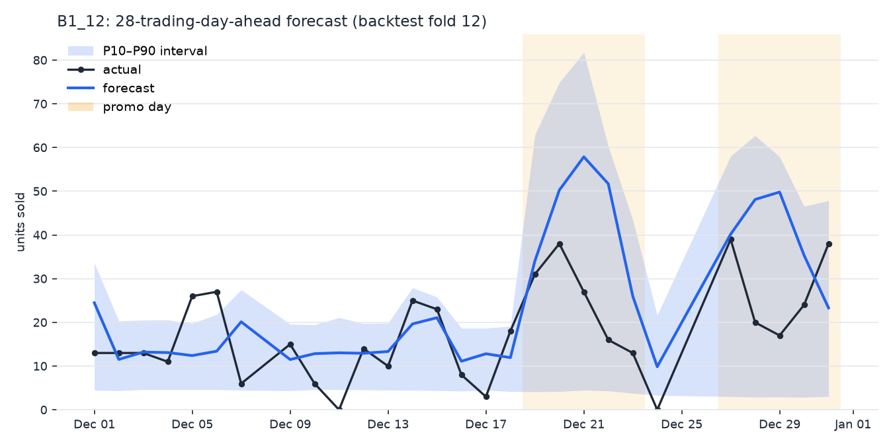

# Demand Forecasting - Promo-Aware Retail Forecasting with Econometric Lift Estimation

Rolling-origin evaluation of three forecasting approaches on 118 daily retail time series, plus a fixed-effects econometric estimate of what promotions actually do to demand.

## Summary

I built this project to answer the two questions a demand planner actually asks: *how much will we sell?* and *what does a promotion buy us?* It compares a seasonal-naive baseline, per-series SARIMAX with promo/holiday regressors, and a single global LightGBM across all series — evaluated the only way time-series models should be: rolling-origin backtests, never a random split. The promotion question gets its own treatment: a Poisson (PPML) fixed-effects panel regression with cluster-robust inference, the standard econometric tool for count outcomes.

The dataset is 5 years of daily sales for 118 pasta SKUs from an Italian retailer — to my knowledge the only openly licensed retail dataset combining daily granularity, multiple years, many series, and an explicit per-SKU promotion flag. It ships in this repository (872 KB, CC BY): clone and run, no accounts, no API keys.

**Key results (12 rolling folds × 28 trading days ahead, all 118 SKUs):**

| Model | MASE | WAPE | RMSE |
|---|---|---|---|
| naive (last value) | 1.074 | 1.082 | 8.86 |
| seasonal-naive (m=7) | 1.002 | 1.027 | 8.75 |
| **global LightGBM (Tweedie)** | **0.652** | **0.644** | **5.23** |

The global model improves MASE by 35% over seasonal-naive, *uniformly across volume terciles* (low 0.64 / mid 0.66 / high 0.66) — it is not hiding poor slow-mover performance behind fast movers. Its P10–P90 quantile forecasts achieve 0.778 empirical coverage against a 0.80 target.

**On the 8 highest-volume SKUs, where classical assumptions hold (same folds):**

| Model | MASE | WAPE | RMSE |
|---|---|---|---|
| **SARIMAX (promo + holiday exog)** | **0.659** | **0.513** | 11.33 |
| LightGBM (trained on the 8-SKU subset) | 0.692 | 0.528 | 10.65 |
| LightGBM (global training, evaluated on the subset) | 0.693 | 0.531 | 10.81 |
| seasonal-naive | 1.043 | 0.835 | 18.01 |

SARIMAX *wins* on this subset — against LightGBM under **both** training scopes: trained on the 8 SKUs alone and trained globally on all 118 with cross-learning (`--train-scope global`), which lands within noise of the subset-trained run. That is the honest headline of the comparison: a well-specified per-series classical model is hard to beat on long, regular, high-volume series, and cross-learning has nothing to add where each series already carries years of its own history. The global ML model earns its keep on *breadth* — the other 110 series, including the intermittent ones where a Gaussian state-space model has no business being fit.

**Promotion lift (PPML, SKU + calendar fixed effects, SEs clustered by SKU, n = 212,164):**

> A promotion multiplies expected daily units by ≈ 4.6× — **+364%** (95% CI [+307%, +429%]).

A log1p-OLS robustness check lands at +184%: attenuated exactly as theory predicts for a log1p approximation on low counts, which is why PPML is the headline estimator and OLS the check, not the other way round.



*28-day-ahead forecast for one SKU in the final backtest fold: the model anticipates the promo-driven spikes (shaded) because the promotion calendar is known in advance, and the P10–P90 band widens where it should.*

## Quick Start (~5 minutes)

### Prerequisites

- **Docker Desktop** with Docker Compose V2 (`docker compose`, not `docker-compose`)
- ~2 GB free disk space
- No API keys, no accounts, no data downloads — the dataset is in the repo

### One-Command Setup

```bash
# Clone the repository and navigate to the project
git clone https://github.com/Medesen/portfolio.git
cd portfolio/demand_forecasting

# Build the image and run the baseline backtest
make setup        # Linux/macOS/WSL2/Git Bash
.\setup.ps1       # Windows PowerShell
```

### Try It Out

```bash
# Global LightGBM: point + P10/P50/P90 quantile forecasts (~10 min)
make backtest ARGS="--model lgbm"

# SARIMAX on the 8 high-volume SKUs (~10 min)
make backtest ARGS="--model sarimax"

# Apples-to-apples: LightGBM restricted to the same 8 SKUs
make backtest ARGS="--model lgbm --subset sarimax"

# Promotion-lift estimation (PPML + OLS robustness, ~5 min)
make promo-lift

# Plot a 28-day forecast with its uncertainty band
make plot

# Reproduce every number in this README in one go (~30-40 min)
make reproduce
```

### Local Alternative (No Docker)

```bash
python -m venv .venv && source .venv/bin/activate
pip install -e ".[dev]"
demandcast backtest --model seasonal_naive
```

## What This Project Demonstrates

### Evaluation discipline

- **Rolling-origin backtesting, never a random split.** Random splits leak future information into training; every number here comes from 12 expanding-window folds whose test windows tile the final year of data.
- **Baselines first.** Without the seasonal-naive reference there is no way to know whether any model adds value over "sell what you sold last week". Most forecasting write-ups skip this; the baseline rows in the tables above are the point of comparison for everything else.
- **A true 28-day-ahead test for every day.** All LightGBM sales-history features are shifted ≥ 28 trading days, so no prediction quietly benefits from yesterday's sales. A dedicated test corrupts the future and asserts the forecasts don't move.
- **Metrics chosen for the data, with reasons on record.** MASE (scale-free across 60× volume differences), WAPE, RMSE — and *not* sMAPE, which is undefined or explosive on zero-sales days. The reasoning lives in [DATA_NOTES.md](DATA_NOTES.md).

### Modelling judgment

- **Right tool, right regime.** SARIMAX is fit only where its Gaussian assumptions roughly hold (an explicit, documented selection rule: top-8 volume, ≤ 10% zero days) — and it wins there. The global LightGBM covers the full assortment with a Tweedie objective suited to zero-inflated counts (ablated against Poisson and plain L2 in [DATA_NOTES.md](DATA_NOTES.md) §2 — L2 wins only on fast-mover-dominated RMSE). The comparison is run on the common subset instead of pretending one tool fits every series.
- **Uncertainty as a first-class output.** Quantile LightGBM produces P10/P50/P90 forecasts evaluated with pinball loss and interval coverage — what a supply planner sizing safety stock actually consumes.
- **Known-in-advance covariates, stated explicitly.** The promotion calendar and holiday calendar are treated as known at forecast time (retail promos are planned weeks ahead). This is standard practice, but it is an assumption, so it is documented rather than smuggled in.

### Econometrics

- **PPML as the main lift estimator** — consistent for count outcomes under conditional-mean correctness (Gourieroux et al. 1984; Santos Silva & Tenreyro 2006), zeros handled natively, coefficients are exact multiplicative effects. SKU fixed effects identify the lift from *within-SKU* promo timing only; SEs are clustered by SKU.
- **Identification honesty.** Promotions are scheduled, not randomized. The estimate is a well-controlled association, and the write-up in [`promo_lift.py`](src/demandcast/analysis/promo_lift.py) states the exact assumption that would make it causal — and what would break it.

**Promotion lift by brand (PPML):**

| Brand | Lift | 95% CI | SKUs | Promo-day share |
|---|---|---|---|---|
| B1 | +263% | [+207%, +331%] | 42 | 0.18 |
| B2 | +471% | [+293%, +731%] | 45 | 0.70 |
| B3 | +598% | [+485%, +733%] | 21 | 0.15 |
| B4 | +736% | [+564%, +953%] | 10 | 0.19 |

B2's interval is the widest for a reason worth noticing: it is the perma-promo brand (15 SKUs on promotion >90% of days), so it contributes almost no within-SKU variation to identify the effect — the data-quality analysis predicted exactly this before the regression was run.

## Evaluation Design

- **Folds:** 12 rolling-origin folds, 28 trading days each, non-overlapping, tiling roughly the final year (2018). Training windows expand; the model at fold *k* sees everything up to that fold's origin and nothing after.
- **Horizon:** 28 trading days — a 4-week retail planning horizon.
- **Trading-day grid:** the 27 calendar gaps in 5 years are Italian public-holiday store closures. They are left as gaps, not zero-filled (a zero would be a fake observation of demand that was never offered). Weekly seasonality is handled weekday-aligned so the gaps can't shift the cycle out of phase.
- **Coverage enforcement:** the backtest runner fails loudly if a model leaves any (date, SKU) pair unpredicted — no silent dropping of hard series.

## The Models

| Model | Scope | Design |
|---|---|---|
| naive | all 118 | last observed value, held flat |
| seasonal-naive | all 118 | last observed value on the same weekday |
| SARIMAX | 8 high-volume SKUs | per-series, log1p scale, AIC order selection among 3 candidates, exog: promo, open-holiday, holiday-eve |
| global LightGBM | all 118 | one model, Tweedie objective (power 1.2), ~26 features: qty lags ≥ 28 trading days, rolling stats, promo schedule (incl. lead terms), calendar, SKU/brand categoricals; early stopping on the last 28 train days; 3 companion quantile models |

Hyperparameters are sensible fixed values, deliberately not tuned: honest tuning (nested inside every fold) would dominate the project's runtime for marginal insight, and un-nested tuning would be leakage. Listed as future work.

## Testing

20 tests, all runnable in Docker:

```bash
make test
```

The ones I'd point a reviewer at:

- **Two leakage tests.** Corrupt every value in the test window by +1,000,000 and assert the forecasts do not change — run against both the harness (via seasonal-naive) and the full LightGBM feature pipeline.
- **PPML recovers a known effect.** A synthetic confounded panel (base rates differing 10×, promo propensity correlated with volume) with a true +50% lift; the fixed-effects estimator must land on it with a covering CI — a pooled comparison would not.
- **Metric correctness** against hand-computed values, including the zero-denominator edge cases that motivated the metric choices.
- **Fold hygiene:** disjoint test windows, train strictly before test, complete prediction coverage.

## Project Structure

```
demand_forecasting/
├── README.md                    # This file
├── DATA_NOTES.md                # EDA findings → design decisions (worth reading first)
├── data/raw/
│   ├── hierarchical_sales_data.csv   # The dataset (872 KB, bundled, CC BY)
│   └── README.md                # Provenance, license, citation
├── src/demandcast/
│   ├── data/                    # Wide→long loader w/ validation; Italian holiday calendar
│   ├── evaluation/              # Rolling-origin folds, backtest runner, metrics
│   ├── models/                  # Baselines, SARIMAX, global LightGBM + quantiles
│   ├── analysis/                # PPML promo-lift estimation; forecast plots
│   └── main.py                  # CLI: backtest / promo-lift / plot-forecast
├── tests/                       # 20 tests incl. leakage + estimator-recovery
├── assets/                      # Example forecast figure
├── Dockerfile / docker-compose.yml / Makefile / setup.sh / setup.ps1
└── outputs/                     # Backtest predictions & scores (gitignored)
```

## Honest Limitations & Future Work

- **No hyperparameter tuning.** LightGBM runs on fixed sensible values; nested-CV tuning is the correct next step and would likely close (some of) the SARIMAX gap on the subset.
- **No deep learning column.** N-BEATS/TFT-class models are the natural third family, but a rushed, under-tuned DL comparison is worse than none; on 118 series the literature expects gradient boosting to remain competitive anyway.
- **Interval calibration is good, not perfect.** 0.778 vs the 0.80 target overall, but 0.70 on the high-volume subset — conformal calibration on top of the quantile models is the obvious remedy.
- **The lift estimate is an average.** A single promo coefficient hides heterogeneity (depth of discount is unobserved in this dataset; lift varies by brand as shown). With promo-depth data, an elasticity model would be the next step.
- **Hierarchy is unused.** The SKUs belong to 4 brands; hierarchical reconciliation (brand/total coherence) is a natural extension — it is what the dataset's source paper (Mancuso et al. 2021) studies.

## License, Dataset License & Citation

The code in this project is MIT-licensed — see the repository
[LICENSE](../LICENSE).

Bundled dataset: "Hierarchical Sales Data" (UCI #611 / Mendeley `njdkntcpc9`), CC BY — details and citation in [data/raw/README.md](data/raw/README.md). Please cite Mancuso, Piccialli & Sudoso (2021), *Expert Systems with Applications* 182:115102 if you reuse the data.

## Troubleshooting

- **`docker-compose: command not found`** — this project needs Compose V2 (`docker compose`). Upgrade Docker, or see the portfolio root README for workarounds.
- **Permission errors on `outputs/`** — run `make` targets (they create the directory host-side first) or `mkdir outputs` before `docker compose run`.
- **Slow SARIMAX/LightGBM backtests** — expected: 12 folds × per-series fits (SARIMAX) or 12 × 4 boosted models (LightGBM). Each prints per-fold progress; ~10 min apiece on a modern laptop.
