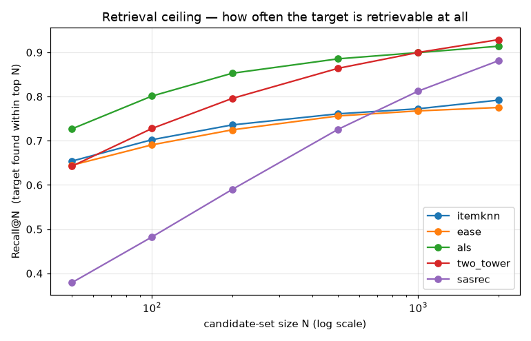
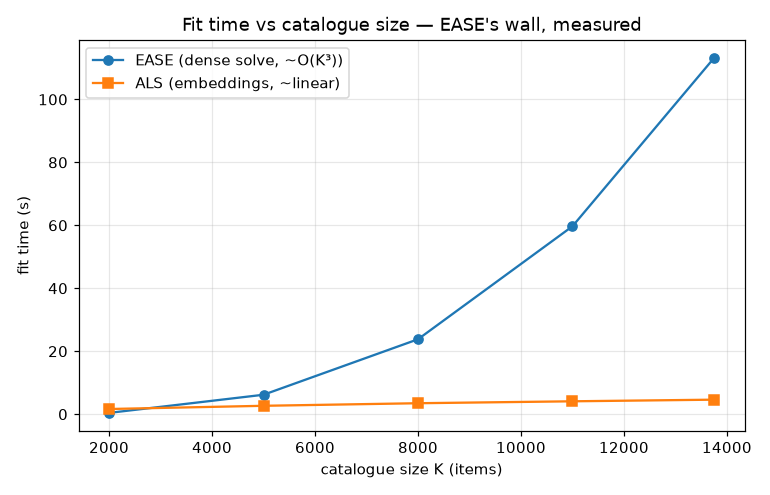
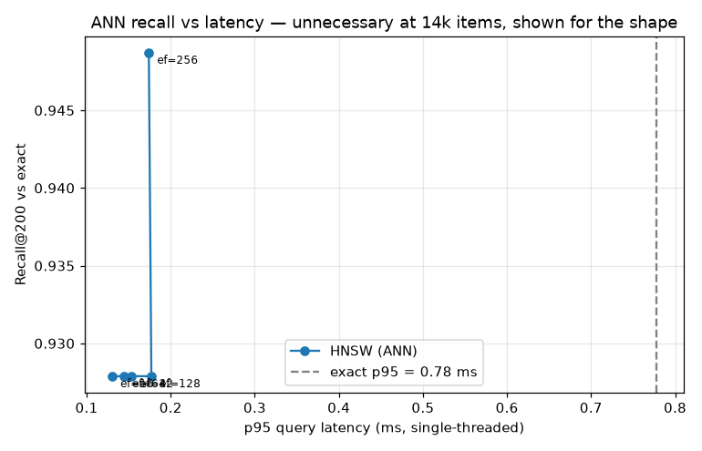

# Recommender Systems - Two-Stage Retrieval & Ranking, and What the Evaluation Protocol Hides

**All three stages complete.** An end-to-end study of session-based recommenders on
real e-commerce data (classical baselines, neural retrieval, and a two-stage
retrieve-and-rank system with serving) built to show that, with recommenders, *how
you measure changes the answer more than what you build*, and that **the model that
wins on ranking is not the one that wins on retrieval**.

It also carries a correction I am choosing to foreground rather than bury. A
repeat-count ablation surfaced that *this project's own ALS baseline was under-tuned*:
the exact "untuned baselines lose" trap (Dacrema et al. 2019) the project is built to
warn about. Its confidence hyperparameter had been searched over far too narrow a
range. Fixing that made ALS competitive with the neighbourhood models and **inverted
the Stage-3 conclusion: with a properly-tuned retriever, the two-stage system beats the
best single model here.** Catching that is, I think, worth more than the tidy negative
result it replaced; see [A correction, foregrounded](#a-correction-foregrounded).

## Summary

Recommender systems had a public reproducibility reckoning that most portfolio
projects never touch, and this one is built on it:

- **Dacrema, Cremonesi & Jannach (2019)**: of 18 neural recommenders from top
  venues, most lost to properly *tuned* classical baselines.
- **Krichene & Rendle (2020)**: evaluating against ~100 sampled negatives (the
  field's default for years) produces model rankings that **disagree** with
  full-catalogue ranking. Leaderboards were partly an artifact of the shortcut.
- **Ludewig & Jannach (2018)**: on session data, simple neighbourhood methods beat
  the neural ones.

The thesis, and what this stage delivers evidence for:

> A recommender's reported quality depends more on the evaluation protocol than on
> the model.

Four tuned classical models (Popularity, ItemKNN, EASE, and implicit-feedback ALS)
are evaluated on RetailRocket (a real e-commerce click/cart/buy log, CC BY-NC-SA
4.0, bundled in this repo). The same models are scored three ways: the honest
full-catalogue protocol, the sampled-negative shortcut, and leave-one-out. **They
disagree on which model wins.** Stages 2 and 3 add neural retrieval (two-tower,
SASRec), a reranker that, on a properly-tuned retriever, beats the best single model,
and the scalability argument for the two-stage architecture industry deploys.

### The honest headline

**On the honest full-catalogue metric the three tuned personalised models are close:
ItemKNN 0.335, EASE 0.334, ALS 0.328, separated only at the last decimal, and the two
neighbourhood leaders are statistically indistinguishable. Switch to the sampled-negative
shortcut every second recommender paper used, and ALS jumps to a clear *first*.** The
shortcut still reorders the board: it crowns the model that is best at the *sampled* task
while the honest metric barely separates the field.

**What the headline measures, and what it sets aside.** Each test session's target is its
*actual* final interaction, chosen **before** any vocabulary filtering. A session whose true
final item is a **cold** item (never seen in training) cannot be scored by any model here, so
it is *excluded* from this warm-target headline and accounted for explicitly: never silently
relabelled onto an earlier warm item. Every post-cutoff session is tracked
(`outputs/cohort_flow.csv`):

| Cohort | Sessions | Share of post-cutoff |
|---|---|---|
| **Warm target** (scoreable, the headline) | **18,059** | 5.5% |
| Cold target (final item is new, a forced miss) | 8,083 | 2.5% |
| Insufficient warm prefix (no history to encode) | 303,378 | 92.1% |
| *Post-cutoff total* | *329,520* | *100%* |

The **warm-target headline** (18,059 sessions) is the fair *model-comparison* number: on
those sessions every model can in principle score the target. Reported beside it is an
**operational** number over the 26,142 sessions that carry a usable history, with the cold
targets counted as the misses they operationally are, which answers the deployed question,
"how often is the *actual* next item predicted?" ItemKNN's warm-target NDCG@20 of 0.335 becomes
**0.232 operational**, because 31% of the sessions with a history have a cold next item no warm
model can reach. Both are honest and answer different questions; the project reports both rather
than letting the easier one stand alone.

**Full-catalogue evaluation: the honest protocol** (18,059 warm-target test sessions,
13,754 items; 95% bootstrap CIs over sessions):

| Model | NDCG@20 | 95% CI | HitRate@20 | MRR@20 | Operational NDCG@20 |
|---|---|---|---|---|---|
| **ItemKNN** | **0.335** | [0.330, 0.341] | 0.585 | 0.262 | 0.232 |
| **EASE** | **0.334** | [0.329, 0.340] | 0.580 | 0.262 | 0.231 |
| ALS | 0.328 | [0.323, 0.333] | 0.612 | 0.246 | 0.226 |
| Popularity | 0.009 | [0.009, 0.010] | 0.028 | 0.004 | 0.006 |

The three are a near-tie on NDCG@20, and the *right* way to separate them is a paired test,
not an eyeball of overlapping marginal CIs. Here the paired bootstrap over ItemKNN's and EASE's
per-session differences **does not resolve a winner: +0.0009 [−0.0003, +0.0019]**: the interval
includes zero, so on this cohort the honest verdict is that the two neighbourhood models are
indistinguishable, not that either wins. (This is itself a correction: on an earlier, looser
cohort the same test *did* resolve a razor-thin ItemKNN edge; tightening the target-selection
protocol dissolved it, which is exactly why the paired test, not the point estimate, is the
thing to trust.) ALS is a hair behind on NDCG@20 but the **best of all four on HitRate@20**
(0.612): it lands the target inside the top 20 more often, it just ranks it a shade lower once
there. Popularity is nowhere. The pre-registered viability bar (*a personalised model must beat
popularity on NDCG@20 with non-overlapping CIs, or the dataset is wrong for the study*) was set
before any model ran and cleared at **36×**.

**The same models, ranked by the sampled-negative shortcut** (each true item scored
against 100 sampled negatives):

| Model | Full-catalogue rank | Sampled rank (uniform) | Sampled rank (popularity) |
|---|---|---|---|
| ItemKNN | **1** | 2 | 2 |
| EASE | **2** | 3 | 3 |
| **ALS** | **3** | **1** | **1** |
| Popularity | 4 | 4 | 4 |

ALS goes from a (near-tie) **third on the honest metric to a clear first** under *both*
negative samplers: its sampled NDCG@20 (0.85 uniform / 0.82 popularity) towers over
ItemKNN's and EASE's (~0.71-0.75). The rank correlation between the honest and the
shortcut ordering is only **0.4** under either sampler. Latent-factor models are good
at separating the target from random negatives (the easy, sampled task) and
comparatively worse at pushing it above all 13,754 items (the hard, real task); sparse
co-occurrence models are the reverse. The shortcut rewards a different skill from the
one that ships, which is the whole point.

**Beyond accuracy: what each model does to the catalogue** (top-20):

| Model | Coverage | Gini (exposure) | Mean popularity percentile |
|---|---|---|---|
| ItemKNN | 98.3% | 0.55 | 0.66 |
| EASE | 98.2% | 0.57 | 0.73 |
| ALS | 91.1% | 0.61 | 0.72 |
| Popularity | 0.2% | 1.00 | 1.00 |

Properly tuned, ALS is well-behaved here too: 91% coverage, with a Gini and popularity
bias in line with EASE, not the concentrated bestseller-chaser the *under-tuned* version
looked like (it scored 58% coverage / 0.77 Gini before the fix). That changes how to
read the sampled disagreement honestly: the shortcut does **not** flatter a commercially
worse model, because there isn't one here: the three personalised models are close on
accuracy *and* comparable on catalogue health. The sampled-vs-honest disagreement is a
pure measurement artifact of the shortcut, not a proxy for a hidden commercial flaw.
(Popularity's 0.2% coverage, the same ~25 items shown to everyone, is why it is
worthless despite being a "baseline".)

**A third protocol, a third answer**: leave-one-out (the field's other default)
against the temporal split:

| Model | Temporal NDCG@20 | Leave-one-out NDCG@20 |
|---|---|---|
| ItemKNN | 0.335 | 0.271 |
| EASE | 0.334 | 0.277 |
| ALS | 0.328 | **0.289** |

Leave-one-out, which trains on interactions that occurred *after* the ones it
predicts, depresses every score *and reorders the podium*: it puts **ALS first**
(0.289), ahead of EASE and ItemKNN, the reverse of the temporal ranking. Training on
the future hands the most extra co-occurrence signal to the latent-factor model. A
different honest-looking protocol, a different leaderboard.

### One finding the project did not go looking for

ItemKNN and EASE are **statistically indistinguishable on NDCG@20** (the paired result
above), yet ItemKNN's sparse fit is sub-second while EASE's dense 13,754² solve takes
**~108 s** (the Stage-3 scaling sweep, on this machine): a >100× fit-cost gap for no
resolvable accuracy difference at all, because EASE inverts a dense item×item matrix and
ItemKNN does not. That is the project's scalability thesis showing up on a dimension it
had not planned to measure, and it is what Stage 3's catalogue-scaling sweep makes
explicit.

### A correction, foregrounded

An earlier version of this project reported ALS at **0.264 NDCG@20**, a distant third,
and concluded that its two-stage system did not beat a good single model. Both claims
were artifacts of a tuning bug I found while remediating a code review, and I am
leaving the story visible, because catching it is the more useful signal.

The trigger was mundane: an ablation to check whether ALS's repeat-*count* confidence
weighting actually helped (the code claimed it did; it turned out the count never
reached the model). Building that ablation forced a proper sweep of ALS's confidence
scale **α**, and revealed that the original grid had capped α at 40, while the
validation optimum is **α = 640** (interior: validation NDCG@20 climbs to α = 640 and
falls again beyond it). ItemKNN and EASE had been tuned properly; ALS's single most
important hyperparameter had not. That is precisely the Dacrema et al. (2019) failure
mode, *baselines lose only when under-tuned*, that this whole project is built to
expose, landing on the project itself.

Re-tuning ALS (selected on the validation window, never on test) moved four things:

- **ALS became competitive**: re-tuning α (40 → 640) lifted it from a distant third
  (0.264 as reported then) to within a hair of the neighbourhood leaders and the *best of all
  four on HitRate@20*; on the current warm-target cohort tuned ALS scores **0.328 NDCG@20**
  at **0.612 HitRate@20**. It is no longer the concentrated, popularity-biased outlier the
  beyond-accuracy table used to show (58% → 91% coverage).
- **The count question resolved cleanly, the other way.** Once α is properly tuned, the
  repeat-count signal is already captured by the confidence scale: count weighting
  *loses* on validation, and its test paired-difference includes zero. So the headline
  ALS is plain binary implicit feedback, and the "counts help" intuition simply did not
  survive a fair comparison. That is reported as the finding it is, not buried.
- **Stage 3 inverted** (see below): with a strong retriever, the two-stage system now
  beats the best single model, where the under-tuned version made two-stage look
  pointless.
- **The central thesis got stronger, not weaker.** "How you measure changes the answer"
  survives intact: the sampled shortcut still disagrees with the honest metric, the
  protocols still disagree, and it now sits beside a live demonstration that one
  mis-set hyperparameter can rewrite a project's conclusions. Measurement discipline is
  the whole point; this is that point, applied to my own work.

Everything downstream in this README reflects the corrected model. The prior numbers are
preserved in git history, and the finding is documented rather than quietly overwritten.

A **second correction** followed, from an external code review of this project: the
warm-target evaluation protocol had been filtering test interactions to the training
vocabulary *before* selecting the held-out final item, which on ~14% of the evaluated cohort
silently moved the target back from a cold final item onto an earlier warm one. The fix
selects the raw final item first and reports the full cohort flow and an operational metric
(see [The honest headline](#the-honest-headline)); it shifted every headline number a little
and, tellingly, dissolved the razor-thin ItemKNN-over-EASE result the paired test had
resolved on the looser cohort. Same lesson as the first correction, applied to the
evaluation protocol rather than a hyperparameter: the discipline is the point.

## Stage 2 - Neural Retrieval, Sequential Models, and Cold Start

Stage 2 adds the modern neural half: a **two-tower** dual-encoder retriever and
**SASRec** (a causally-masked sequential transformer), and the analysis that turns a
model bake-off into a *systems* study. All neural models are CPU-trainable (the whole
Stage 2 pipeline runs in ~15 minutes on a laptop); PyTorch is the only new dependency.

### The Stage 2 headline: ranking skill and retrieval skill are different skills

On the honest full-catalogue metric, the two-tower **loses**: it ranks the target in
the top 20 less well than the tuned classical models:

| Model | NDCG@20 | HitRate@20 |
|---|---|---|
| ItemKNN (classical) | **0.335** | 0.585 |
| EASE (classical) | 0.334 | 0.580 |
| ALS (classical) | 0.328 | 0.612 |
| **Two-tower** | 0.272 | 0.529 |
| SASRec (full-softmax) | 0.138 | 0.287 |
| SASRec (sampled-BCE) | 0.021 | 0.056 |

You could stop there and conclude the neural models simply lost. But **NDCG@20 is a
*ranking* metric, and retrieval is a different job.** A two-stage system's first stage
does not need to rank the target first: it needs to get it *somewhere* in a candidate
set of a few hundred to a couple of thousand, which a downstream ranker then reorders.
Measured that way (Recall@N, "is the target retrievable at all") the order **flips**:

| Retriever | R@50 | R@100 | R@500 | R@1000 | **R@2000** |
|---|---|---|---|---|---|
| ItemKNN | 0.675 | 0.722 | 0.778 | 0.788 | 0.805 |
| EASE | 0.666 | 0.711 | 0.774 | 0.785 | 0.791 |
| ALS | 0.747 | 0.820 | 0.899 | 0.912 | 0.924 |
| **Two-tower** | 0.663 | 0.748 | 0.880 | 0.913 | **0.939** |
| SASRec | 0.406 | 0.513 | 0.754 | 0.835 | 0.898 |



**The neighbourhood models that lead on ranking (ItemKNN, EASE) are the *worst*
retrievers.** They peak early and saturate: ItemKNN finds 68% of targets in its top 50
but only 80% even by 2000, because sparse co-occurrence has nothing to say about items a
session has no direct neighbour link to. The embedding models keep finding relevant
items as the net widens: the two-tower is the best retriever at depth (94% by 2000), and
ALS, now a *near-top ranker as well*, is close behind (92%), which is exactly what
makes it the retriever Stage 3 builds on. *This is why industry builds two-stage
systems*: a high-recall embedding retriever to cast the net, then an expensive ranker
to sort it. The gap between "found it" (retrieval) and "ranked it first" (NDCG@10) is
the room Stage 3's reranker works in.

Blending retrievers helps only modestly (the union of all five reaches 0.939 at a
500-item budget each, vs 0.899 for the best single retriever (ALS) at the same budget):
their misses are correlated, which is itself worth knowing for Stage 3.

### Three ablations, three findings

| Ablation | Result |
|---|---|
| **Item tower: content path** | id+content **0.272** > id-only 0.245 > content-only 0.134: the content features earn their place, adding ~11% NDCG over IDs alone |
| **logQ correction** | on **0.272** vs off 0.228: the correction *helps* accuracy (+19%) but concentrates recommendations on popular items (popularity percentile 0.55 → 0.70, coverage 0.97 → 0.93): a real trade-off, and the *opposite* direction from a naive guess (it removes the in-batch sampler's incidental suppression of popular items) |
| **SASRec loss** | full-softmax **0.138** vs sampled-BCE 0.021: a **6.4× gap** from the loss function alone, reproducing Klenitskiy & Vasilev (2023): the loss mattered far more than the architecture, and a line of published SASRec-vs-BERT4Rec comparisons was confounded by it |

SASRec underperforms here in absolute terms (0.138): RetailRocket sessions average
~3 items, so a sequential model has little order to exploit, exactly the regime where
Ludewig & Jannach (2018) found simple methods win. It is also lightly trained (8
epochs, CPU budget). The robust finding is the *loss ablation*, which holds regardless
of the model's absolute level.

### Are these ablation gaps just one lucky seed?

The neural models, the reranker, and their negative sampling are all seeded, so a single run
could make a small margin look real by chance. Retraining the reported configurations across
**three seeds** (`reclab seed-sensitivity` → `outputs/seed_sensitivity_deltas.csv`) shows the
headline gaps are seed-robust: the direction never flips and every range stays clear of zero:

| Claim (paired within each seed) | Mean Δ NDCG@20 | Range across seeds |
|---|---|---|
| logQ on − off (two-tower) | **+0.043** | [+0.041, +0.047] |
| reranker − retriever (Stage 3) | **+0.017** | [+0.016, +0.017] |
| LambdaMART − pointwise (Stage 3) | **+0.004** | [+0.004, +0.004] |

The two-tower's logQ lift is ~18% of its NDCG and never dips below +0.041; the two-stage
reranker's edge over its own retriever is stable to the third decimal. The bootstrap CIs
elsewhere quantify *evaluation-sample* uncertainty (resampling sessions); this separates out
*training* variance, so the neural and reranker claims rest on both.

### Cold start: a real capability, still beaten by a simple heuristic

The classical models **cannot score an item with no training interactions**: the
recommendation is structurally impossible, so their cold-start recall is exactly 0.
The two-tower *can*, from an item's content (category, parent category, availability).
On the strictly-cold slice (targets with zero pre-cutoff interactions), ranking among
cold candidates:

| Model | Cold-start Recall@20 |
|---|---|
| category-popularity heuristic | **0.210** |
| Two-tower (content) | 0.161 |
| ItemKNN / EASE / ALS | 0.000 (structural) |

The heuristic's popularity is counted **as of each session's own prediction time**: a
new item's frequency *before* that session, never the whole-test-period count, which
would let the baseline peek at events after the session (and at the target's own
occurrence). That correction is what makes it a deployable heuristic rather than an
oracle; it costs the baseline a little (0.229 → 0.210 under the honest, causal count),
and it *still* beats the two-tower. The two-tower breaks the structural barrier the
classical models hit, but a simple *most-popular-new-item-in-the-session's-category*
heuristic wins anyway. And this is all on a **3.7% slice**: only 3.7% of evaluable test
targets are genuinely new items (9.8% have fewer than 5 prior interactions). So the
neural cold-start capability is real and the classical models genuinely lack it, but on
this dataset its commercial value is bounded by both the margin (a heuristic wins) and
the slice size. Reporting the advantage next to the 3.7% denominator is the honest
framing; an advantage on a slice few sessions reach is a small advantage.

## Stage 3 - Ranking, Approximate Search, and Serving

Stage 3 builds the second half of the actual architecture: a **LightGBM reranker**
over retrieved candidates, an **HNSW** approximate-nearest-neighbour index, a minimal
**FastAPI `/recommend`** endpoint with per-stage timing, and the **catalogue-scaling
sweep** that turns EASE's memory wall from arithmetic into a measured curve.

### The nested-window training design (the subtle part)

A reranker trains on *candidates a retriever produced*, labelled by what the user did
next. The quiet failure: if that retriever was fit on the very interactions used as
labels, its scores are in-sample during training and out-of-sample at serving: the
ranker learns to trust a signal that will be weaker in production, and nothing
crashes. The fix is a nested temporal split: fit the candidate-generating retriever
on period **A**, label on **B**, and keep the Stage 1/2 test window **C** untouched
(retrieval refit on `[start, T2)` for the final pass). The
[`test_ranker_data.py`](tests/test_ranker_data.py) feature-leakage test (permute the
labels, assert every feature is bit-identical) was written *before* the ranker
existed.

### Does the reranker help? Yes, and the two-stage system now beats the best single model

The candidate generator is ALS (a strong embedding retriever, Recall@500 ≈ 0.90, which
caps the two-stage system). Reranking its 500 candidates:

| System | NDCG@20 | HitRate@20 | Coverage@20 |
|---|---|---|---|
| Retrieval only (ALS order) | 0.328 | 0.612 | n/a |
| **Two-stage (LambdaMART rerank)** | **0.345** | 0.630 | 0.88 |
| Two-stage (pointwise rerank) | 0.341 | 0.628 | n/a |
| *Reference: best single-stage (ItemKNN)* | *0.335* | *0.585* | n/a |

Two claims, both now paired-tested rather than eyeballed (the reranked, pointwise and
retrieval-only orderings all score the same sessions, so the differences pair up):

- **The reranker beats its own retriever, resolvably:** 0.328 → 0.345, a paired
  **+0.017 [+0.016, +0.019]** on NDCG@20, and it does not collapse catalogue coverage
  (0.88).
- **LambdaMART beats the pointwise objective, resolvably:** 0.345 vs 0.341, a paired
  **+0.004 [+0.003, +0.005]**: the listwise objective earns a little, now said with an
  interval rather than a point-estimate hunch.

And the reversal: the two-stage system (0.345) **now beats the best single-stage model**
(ItemKNN 0.335 on NDCG@20, and 0.630 vs 0.585 on HitRate). With the *under-tuned* ALS
this was not true: the reranker lifted a weak 0.264 retriever to 0.298, short of
ItemKNN, and the honest-but-wrong conclusion was "two-stage doesn't pay off here." The
feature set is genuinely thin: RetailRocket has no prices, no text, only hashed
properties, so `retr_score` and `retr_rank` dominate the ranker's gain, but on top of a
*strong* retriever that thin reranker is enough to edge past the best single model.

The corrected result is sharper than the tidy negative it replaced:

> With a properly-tuned retriever, the two-stage system beats the best single model on
> this catalogue: the reranker adds a resolved lift on top of a strong ALS retriever.
> The earlier "two-stage doesn't pay off here" was an artifact of an *under-tuned
> retriever*, not a property of the data: a two-stage system inherits its retriever's
> ceiling, and raising that ceiling flipped the verdict.

The lesson is **retrieval quality gates everything downstream**, a more useful takeaway
than "the architecture is unrewarded here." The accuracy win itself is modest (a thin
feature set on a small catalogue), so the *durable* case for two stages is still the
industrial one: serving a catalogue too large to score exhaustively. That is a
*scalability* argument, separate from accuracy, and it is the one the next section makes
concrete on EASE's dense solve.

### The scaling wall, measured

Which is the whole point of the closing argument, and the scaling sweep makes it
concrete. EASE's dense item×item solve is ~O(K³); ALS's embedding factorisation is
roughly linear. Fit time on the real matrix, restricted to the top-K popular items:

| Catalogue K | EASE fit | ALS fit | EASE ÷ ALS |
|---|---|---|---|
| 2,000 | 0.39 s | 1.44 s | 0.27× |
| 5,000 | 5.62 s | 2.51 s | 2.2× |
| 8,000 | 22.4 s | 3.22 s | 6.9× |
| 11,000 | 56.6 s | 3.92 s | 14.4× |
| 13,754 | 108.4 s | 4.24 s | **25.6×** |



EASE is *faster* than ALS on a small catalogue and **25.6× slower** by the full 13,754
items, growing as ~K^2.9, close to the cubic its dense solve implies, while ALS stays
roughly flat. Extrapolating the memory side (stated as arithmetic, not measured):
EASE's dense matrix is 3.2 GB at 20k items, 80 GB at 100k, and **442 GB at the full
235k-item catalogue**: the model that wins the benchmark cannot be trained on the
catalogue. The measured time curve plus the stated memory arithmetic is the honest whole.
(These fit times are single-run and machine-dependent; the point is the *shape*, which
`check_readme.py` deliberately does not pin.)

### Approximate nearest neighbours: measured, and honestly unnecessary here

ANN applies only to the **embedding** retrievers (ALS, two-tower); EASE and ItemKNN
produce item-item similarity, not a metric space, so fast vector search does not apply
to them: EASE's disadvantages compound (quadratic memory, no cold start, *and* no ANN
serving path). HNSW over the ALS embeddings:



HNSW recovers **~93% of the exact top-200 at ~5× the query speed** (p95 ≈ 0.11 ms vs
exact 0.58 ms). But at 13,754 items **exact search is already sub-millisecond, so ANN
is unnecessary**: it is built and measured for the *shape* of the trade-off, whose
crossover is a property of catalogue size, not of this dataset. Overselling it would
undercut a project whose premise is not overselling things.

### Where the milliseconds go

The `/recommend` endpoint composes the whole system, timed per stage (single-threaded,
in Docker, a shape, not a production SLA):

| Stage | p50 (ms) | Share |
|---|---|---|
| user embedding (fold-in) | 0.22 | 5% |
| retrieval (ANN) | 0.39 | 9% |
| **feature assembly** | 2.60 | **58%** |
| **ranking** | 1.17 | **27%** |
| filter + top-k | 0.06 | 1% |
| total | 4.43 | 100% |

**Feature assembly and ranking dominate; retrieval is 9%.** That is exactly why
production systems retrieve cheaply and wide, then rank expensively and narrow: the
two-stage split made visible in a latency budget.

**What production would change** (documented, not built): features from a feature
store rather than in-memory assembly (the 60% above); the ANN index rebuilt on a
schedule with atomic swap; model artifacts in a registry; the ranker retrained on a
different cadence from retrieval; and request-level logging of served candidates,
which is the prerequisite for the off-policy evaluation this project declines to fake.

## Quick Start (~5 minutes)

### Prerequisites

- **Docker Desktop** with Docker Compose V2 (`docker compose`, not `docker-compose`)
- ~6 GB free disk space (the image includes CPU-only PyTorch); **~4 GB RAM** free
  (EASE inverts a dense item×item matrix)
- No API keys, no accounts, no data downloads: the dataset is bundled
- No GPU required or used: every neural number is generated on CPU by design

### One-Command Setup

```bash
git clone https://github.com/Medesen/portfolio.git
cd portfolio/recsys_two_stage

make setup        # Linux/macOS/WSL2/Git Bash
.\setup.ps1       # Windows PowerShell
```

### Try It Out

```bash
# Stage 1 - classical models & evaluation protocols
make eda          # dataset summary + the filter-threshold grid
make evaluate     # full-catalogue evaluation, all four classical models (~4 min)
make als-count-ablation  # ALS repeat-count vs binary confidence weighting (tuned)
make sampled      # sampled-negative evaluation + the disagreement table (~4 min)
make beyond       # coverage / Gini / popularity-bias metrics
make protocols    # temporal vs leave-one-out
make tune         # re-run the validation-window grid search (regenerates TUNED_PARAMS)

# Stage 2 - neural retrieval, ablations, ceiling, cold start
make features     # item content-feature coverage (as-of cutoff)
make neural       # train + evaluate the two-tower and SASRec (~14 min, CPU)
make ablations    # logQ on/off, id vs content, full vs sampled loss
make ceiling      # retrieval-ceiling analysis + blending + figure
make cold-start   # cold-item evaluation vs the category-popularity baseline

# Stage 3 - reranker, ANN, scaling, serving
make evaluate-e2e   # end-to-end two-stage reranker evaluation
make ann-sweep      # HNSW recall/latency sweep + Pareto figure
make scaling        # catalogue-scaling sweep (EASE's wall, measured)
make build-service  # fit + persist the serving artifacts
make serve          # launch the FastAPI recommender (POST /recommend, GET /health)
make latency        # per-stage serving latency harness

make seed-sensitivity # training-seed robustness of the neural/reranker claims
make reproduce    # regenerate every reported number, end to end (~90 min)
make check-readme # verify the README's headline numbers against outputs/
```

### Local Alternative (No Docker)

```bash
python -m venv .venv && source .venv/bin/activate
pip install -e ".[dev]"
reclab evaluate
```

## What This Project Demonstrates

### Evaluation discipline

- **The honest protocol is the headline, the shortcut is shown up.** Full-catalogue
  ranking is the default reported here; the sampled-negative metric is computed
  *specifically to demonstrate that it disagrees*, with the rank correlation stated.
  Most write-ups report only the shortcut.
- **A global temporal split, never leave-one-out as the headline.** Training is
  everything before a cutoff; testing is after. Leave-one-out is included only as a
  comparator: it trains on the future, and the numbers show what that buys.
- **The filter is fit on the training window only.** Deriving the k-core from the
  whole dataset lets test-period activity decide the training vocabulary, a subtle
  leak most preprocessing carries. The leaky variant is available behind
  `--filter-scope global` so the difference can be measured.
- **Beyond-accuracy metrics as first-class outputs.** Coverage, Gini, and popularity
  bias, because a recommender that only shows bestsellers can score adequately and
  be commercially worthless.
- **Uncertainty on every headline number** via bootstrap CIs over sessions, a
  **pre-registered viability bar** fixed before any model was run, and, where two models
  are compared, a **paired bootstrap over per-session differences**, not an eyeball of
  overlapping marginal CIs. It reports whatever the data supports: it *declines* to
  separate ItemKNN from EASE (the paired difference includes zero) while *resolving* both
  reranker comparisons: the honest verdict either way, and multi-seed sensitivity behind
  the stochastic claims so a margin can't be one lucky seed.
- **The evaluated cohort is accounted for, not assumed.** The warm-target headline is the
  set of sessions whose *actual* next item is scoreable; cold-target and prefix-less
  sessions are counted in a published cohort-flow table, and an **operational** metric
  reports the deployed "predict the actual next item" number with cold targets as the
  misses they are, so the headline can't quietly condition away the hard cases.

### Modelling judgment

- **Baselines are tuned, not stubbed.** The entire Dacrema et al. result is that
  baselines lose only when under-tuned, so every model gets a real grid search on a
  nested temporal validation window: ItemKNN's shrinkage alone is worth +0.009 NDCG.
  Winners are selected on validation, never on test. This project also *failed* that bar
  once and caught it: ALS's confidence α had been searched over too narrow a range, and
  fixing it changed the headline; see [A correction, foregrounded](#a-correction-foregrounded).
- **EASE from the closed form**, one hyperparameter, validated in the tests against
  an independent column-wise ridge solve, and instrumented with the memory wall
  (13,754 items = 1.5 GB dense; 235k items = 442 GB) that is the whole point.
- **ALS folded in by hand.** `implicit` learns the item factors; the session-vector
  fold-in for unseen sessions is implemented directly (Hu et al. eq. 4), keeping ALS
  behind the same "score an unseen session from its history" contract as every other
  model: the constraint the single-visit data forces.
- **Neural models from scratch, CPU-only.** The two-tower (history-pooling user tower,
  no user-ID embeddings; item tower = ID + content; in-batch sampled softmax with logQ
  correction) and SASRec (causally-masked transformer, full-softmax vs sampled-BCE
  loss) are written in PyTorch and plug into the *unchanged* Stage 1 evaluation harness
  via a `HistoryBatch` that carries ordered sequences alongside the binary bag: the
  abstraction generalised, not special-cased.
- **Retrieval framed as a first-class, separate skill from ranking.** The
  retrieval-ceiling analysis measures Recall@N up to 2000 candidates, which is what
  exposes that the ranking winners are the retrieval losers: the finding that makes
  this a two-stage *systems* project rather than a leaderboard.

### Data judgment

- **The pivot is documented, not hidden.** RetailRocket users barely persist (79.6%
  view one item ever), so a user-based protocol was abandoned for a session-based one
  *before* modelling; see [DATA_NOTES.md](DATA_NOTES.md), worth reading first. The
  reasoning, the pre-registered test, and the dataset-choice trade-off (RetailRocket
  over MovieLens: bundleable licence, real behaviour, content features for Stage 2)
  are all on record.

## Testing

154 tests, all runnable in Docker, and run on pushes to `main` and pull requests by a
**GitHub Actions workflow** (lint + full suite + `check_readme.py` against the committed
result tables + a package smoke test):

```bash
make test
```

The ones worth a reviewer's eye:

- **The Krichene-Rendle reversal, as a test.** On synthetic data with a known true
  model ordering, full-catalogue evaluation recovers it and sampled evaluation
  **reverses** it: the paper's result turned into a property that fails if the
  effect ever stops reproducing (`test_sampled_bias.py`).
- **Paired-bootstrap inference, and where marginal CIs mislead.** A synthetic case
  where two models' marginal CIs overlap but their paired per-session difference clearly
  excludes zero: the exact failure mode behind the old "tie (CIs overlap)" claim, now a
  test (`test_evaluation.py`).
- **The cold-start baseline cannot see the future.** Popularity is counted strictly
  before each session's prediction time; adding an interaction *after* a session leaves
  its ranking unchanged: the anti-leak property asserted directly (`test_cold_start.py`).
- **ALS counts change the factorisation only when counts exist.** `use_counts` alters
  the fit on a count-valued matrix but is a no-op on binary input: the property the
  headline binary ALS and the count ablation both rely on (`test_models.py`,
  `test_splitting.py`).
- **SASRec causal masking.** Perturb the item at a later sequence position and assert
  every earlier output is bit-identical: a causal-masking bug would let the model
  see the future it is predicting, and this is the transformer-shaped analogue of the
  temporal-leakage test (`test_sasrec.py`).
- **The two-tower's cold-start claim, as a property.** The content path lets a cold
  item find its cluster; the `id_only` ablation demonstrably cannot: the
  architectural claim asserted, not just asserted about (`test_two_tower.py`).
- **Ranker feature leakage, written before the ranker.** Permute the held-out labels
  and assert every ranker feature is bit-identical: a feature that peeked at the
  target would fail (`test_ranker_data.py`); plus the nested-window A ≺ B ≺ C ordering.
- **The `/recommend` contract, structure not wall-clock.** Per-stage timings exist and
  sum to the reported total; bad `k` returns 422 not 500; seen items never appear in
  the output. Timing *values* are never asserted: those are flaky (`test_api.py`).
- **Neural sanity.** On a trivially learnable clustered world both neural models must
  reach near-perfect recall: catching the silent failure of a model that trains
  cleanly but learns nothing (`test_neural_sanity.py`).
- **EASE against a brute-force solve.** The closed form is checked against an
  independent, column-wise ridge regression: the same optimisation attacked a
  different way (`test_models.py`).
- **Temporal leakage.** Corrupt every post-cutoff interaction and assert the trained
  matrix is bit-identical; straddling sessions are dropped, not truncated
  (`test_splitting.py`).
- **Target preservation, as a regression.** A test session whose true final item is cold
  must be *excluded* from the warm headline, never relabelled onto an earlier warm item,
  and the cohort-flow counts must account for every post-cutoff session: the property the
  P0-1 protocol fix turns on (`test_splitting.py`).
- **Seen-item masking is central, not per-model**, and **k-core reaches a genuine
  fixed point**: a second application is a no-op.

## Project Structure

```
recsys_two_stage/
├── README.md                     # This file
├── DATA_NOTES.md                 # EDA findings → design decisions (read first)
├── PLAN_STAGE1/2/3.md            # The full three-stage build plan
├── data/
│   ├── raw/
│   │   ├── events.csv.gz          # The event log (32 MB, bundled, CC BY-NC-SA 4.0)
│   │   ├── item_properties.csv.gz # Distilled item properties (Stage 2 uses these)
│   │   ├── category_tree.csv.gz   # Category hierarchy
│   │   └── README.md              # Provenance, licence, checksums, columns
│   └── prepare_item_properties.py # Distillation script (documented, not run in CI)
├── src/reclab/
│   ├── data/                     # Loading, sessionisation, iterative k-core
│   ├── splitting/                # Temporal + leave-one-out protocols (carry sequences)
│   ├── features/                 # Item content features, snapshotted as-of cutoff
│   ├── models/                   # Popularity, ItemKNN, EASE, ALS, TwoTower, SASRec
│   ├── evaluation/               # Metrics, full-catalogue, sampled, beyond-accuracy,
│   │                             #   retrieval-ceiling, cold-start
│   ├── tuning/                   # Nested temporal-validation grid search
│   ├── ranking/                  # Nested-window ranker data + LightGBM reranker
│   ├── serving/                  # HNSW ANN index + FastAPI app + timed pipeline
│   ├── scaling.py                # Catalogue-scaling sweep (EASE's wall)
│   ├── stage2.py / stage3.py     # Stage orchestration
│   └── main.py                   # CLI: eda/…/neural/ceiling/evaluate-e2e/ann-sweep/scaling/serve/all
├── tests/                        # 154 tests
├── assets/                       # Committed figures: retrieval ceiling, ANN, scaling
├── scripts/check_readme.py       # Verifies README numbers against outputs/
├── Dockerfile / docker-compose.yml / Makefile / setup.sh / setup.ps1
└── outputs/                      # Canonical result CSVs committed (README-checked);
                                  #   models, ANN indexes, plots, serving artifacts gitignored
```

## Honest Limitations & Future Work

### Known limitations of the project

- **Single held-out target per session**, so Recall@k collapses to HitRate@k; the
  metric set is HitRate / NDCG / MRR by design, stated rather than papered over.
- **ALS is capped at 128 factors** to stay CPU-trainable; the neural models are
  likewise CPU-sized: the two-tower runs 12 epochs and SASRec is lightly trained at 8.
  Their *ranking* level would rise with more compute, but the qualitative findings (the
  two-tower's high retrieval recall, the loss ablation) are robust to it: the 3-seed
  sensitivity sweep confirms the ablation gaps hold across training seeds.
- **SASRec is weak in absolute NDCG** because RetailRocket sessions are ~3 items, a
  short-session regime where sequential order carries little, exactly where the
  literature expects simple methods to win. It is included to *make* that point and to
  carry the loss ablation, not because it was expected to top the table.
- **The reranker uses a thin feature set** (no prices, no text, hashed properties) so
  it leans heavily on the retrieval score. It still edges past the best single-stage
  model here (see Stage 3), but the accuracy margin is small; the durable case for two
  stages is scalability (EASE's wall), not this modest accuracy win.
- **The scaling wall is measured in *time*, extrapolated in *memory*.** EASE fits
  comfortably at 13,754 items, so the sweep shows super-linear fit-time growth on real
  subsets; the 442 GB at the full catalogue is arithmetic, stated as arithmetic.
- **Latency is a single-threaded laptop measurement in Docker**: the informative part
  is the per-stage *share*, not the absolute milliseconds.
- **`make reproduce` refits models across subcommands** where a fully shared cache
  would not, and now also runs the 3-seed sensitivity sweep, so it takes ~90 min; the
  `stageN` and `all` paths already fit each unique model once, which is where the cost
  lives.

### Deliberately not built (and why)

- **LLM-based recommenders**: no settled evaluation methodology; including one would
  dilute a project whose entire point is honest measurement.
- **Bandits / off-policy evaluation**: genuinely important, and a separate project:
  this dataset carries no logged propensities, so off-policy estimates would be
  fiction.
- **Graph neural networks (LightGCN etc.)**: already covered by the "tuned baselines
  win" literature this project builds on; adding one would restate the finding.
- **A Kubernetes / monitoring stack, and a feature store**: the churn work in the
  sibling [`end2end_churn`](../end2end_churn/) project already demonstrates serving,
  metrics, and deployment; the `/recommend` endpoint here is a *latency-measurement
  instrument*, not a second product. What production would change is documented above,
  not built.

## Licence, Dataset Licence & Citation

The code in this project is MIT-licensed. See the repository [LICENSE](../LICENSE).

Bundled dataset: the **RetailRocket recommender system dataset**, **CC BY-NC-SA
4.0**: free to redistribute with attribution for non-commercial use, which is why
it ships in this repo. The distilled `item_properties.csv.gz` is an adaptation and
carries the same licence; the code does not. Provenance, checksums, and column
documentation are in [data/raw/README.md](data/raw/README.md). Please credit
Retailrocket / Roman Zykov if you reuse the data.

> **Why RetailRocket over MovieLens** (the field's usual benchmark): its licence
> permits redistribution, so the project keeps its clone-and-run promise; it is real
> e-commerce behaviour with genuine timestamps, so a temporal split reflects a
> deployed system; and it carries product attributes, without which the Stage 2
> cold-start comparison would be impossible. The cost is comparability with published
> MovieLens numbers, a trade made deliberately in favour of realism and a
> shippable licence.

## Troubleshooting

- **`docker-compose: command not found`**: this project needs Compose V2 (`docker
  compose`). Upgrade Docker, or see the portfolio root README.
- **Permission errors on `outputs/`**: run the `make` targets (they create the
  directory host-side first) or `mkdir outputs` before `docker compose run`.
- **`MemoryError` from EASE**: it needs a dense item×item matrix (~1.5 GB at the
  default catalogue). Free some RAM, or raise the item filter with a stricter
  `min_item_sessions`. The error prints the arithmetic: that constraint is the
  point, not a bug.
- **Slightly different last-digit ALS numbers**: `implicit`'s multithreaded ALS can
  perturb the factor init at the margin; the ItemKNN/EASE/popularity numbers are
  exact.

---

**Last Updated:** July 2026  
**Docker Support:** Linux, macOS, Windows  
**Total Setup Time:** ~5 minutes
